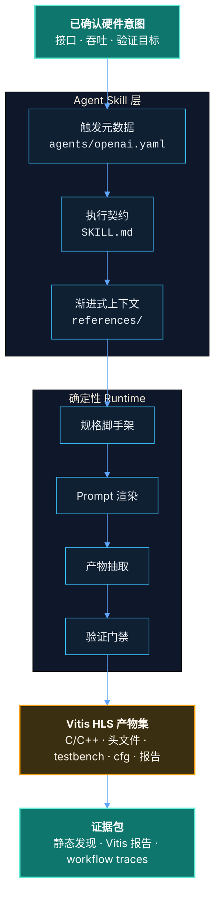
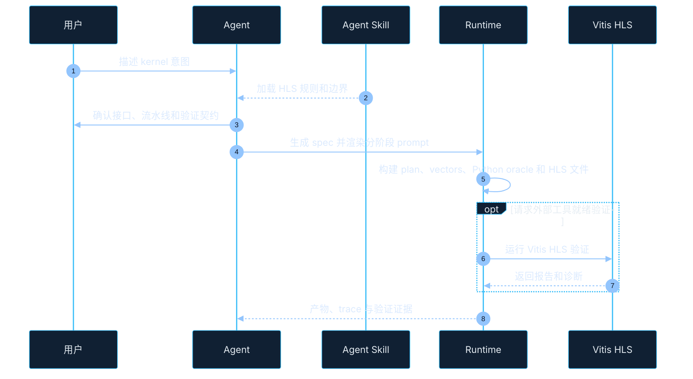

<p align="center">
  <a href="README.md">English</a>
  <span>&nbsp;|&nbsp;</span>
  <a href="README-CN.md"><strong>中文</strong></a>
</p>

<p align="center">
  
</p>

<p align="center">
  <a href="LICENSE"></a>
  <a href="pyproject.toml"></a>
  
  <a href="SKILL.md"></a>
  <a href="references/vitis-hls-official-patterns.md"></a>
</p>

<h1 align="center">HLS Generator</h1>

<p align="center">
  面向 Codex/Agent 的 AMD/Xilinx Vitis HLS 专业工作流 Skill。
</p>

HLS Generator 用来把 AI 编程代理变成更可靠的 HLS 工程助手。它提供触发元数据、工作流指令、参考文档、确定性 runtime、示例规格和验证门禁，帮助 Agent 从确认后的硬件意图稳定推进到可审查的 Vitis HLS 产物。

这个仓库首先是一个 **Agent Skill Package**。Python CLI 是确定性执行层，但主要入口是 Agent 可加载、可遵循的 skill 结构。

## 为什么需要它

硬件生成最容易出错的地方，是 Agent 从模糊需求直接跳到代码。HLS Generator 在中间补上工程化步骤：需求确认、接口契约、分阶段规划、测试向量、Python reference 检查、HLS 产物抽取和验证证据。

适用场景包括：

- Vitis HLS C/C++ kernel、头文件和 testbench。
- AXI memory、AXI4-Stream、native scalar 和自定义接口契约。
- `PIPELINE`、`DATAFLOW`、`ARRAY_PARTITION`、`STREAM` 等 pragma 决策。
- HLS 配置、Tcl 渲染、报告收集和工具链就绪检查。
- 调试 HLS 生成 RTL 的接口问题，并回溯到 HLS 源码、pragma、配置或报告。

## Skill 架构



## 工作流



## 仓库结构

| 路径 | 作用 |
| --- | --- |
| `SKILL.md` | 面向 Agent 的触发、流程、约束和工具使用规则。 |
| `agents/openai.yaml` | Skill 列表和调用入口的 UI 元数据。 |
| `runtime/hls_generator/` | scaffold、prompt 渲染、抽取、验证、报告和 workflow 状态。 |
| `integration/hls_adapter.py` | 面向宿主应用的稳定接口。 |
| `assets/examples/` | stream、memory、dataflow、partition、reshape、fixed-point、multi-`m_axi` 等 HLS spec 示例。 |
| `references/` | Vitis HLS 策略、配置规则、工作流契约、集成说明和注释风格指南。 |

## 快速开始

把本仓库放入 Codex skill 搜索路径即可作为 Agent Skill 使用。开发 runtime 或做本地检查时：

```powershell
python -m runtime.hls_generator --version
python -m runtime.hls_generator config --path
python -m runtime.hls_generator scaffold --target hls --name vector_scale --out .\reports\hls\spec.json
python -m runtime.hls_generator prompt --target hls --spec .\reports\hls\spec.json --out .\reports\hls\prompt.md --comment-language en
```

不依赖 AMD/Xilinx 外部工具的静态验证：

```powershell
python -m runtime.hls_generator validate --target hls --spec .\reports\hls\spec.json --path .\reports\hls\generated --readiness static --no-external
```

外部验证需要真实 Vitis HLS 环境。只有实际运行 `vitis-run` 或 `vitis_hls` 后，才可以声称 Vitis 验证通过。

## 集成接口

```python
from integration.hls_adapter import (
    render_hls_prompt,
    run_hls_workflow,
    validate_hls_artifacts,
)
```

- `run_hls_workflow(...)`：运行或恢复分阶段 HLS 工作流。
- `render_hls_prompt(...)`：宿主系统自行调用模型时渲染 prompt。
- `validate_hls_artifacts(...)`：下游使用前验证生成产物。

## 边界

- 生成 Vitis HLS C/C++ 产物，不生成手写 RTL。
- Python model 和 vectors 是验证中间层，不是硬件交付物。
- HLS 生成 RTL 的问题只有在能回溯到 HLS 代码、pragma、配置或报告时才属于本 skill 范围。
- 本地密钥、私有硬件设计、生成缓存和私有远程服务器细节不应进入仓库。

## 联系方式

问题、合作或学术使用，请联系：[erie@seu.edu.cn](mailto:erie@seu.edu.cn)。

## 引用

如果本 skill 对你的研究、教学或工程流程有帮助，请引用：

```bibtex
@software{hls_generator_skill,
  title        = {HLS Generator: An Agent Skill for Vitis HLS Workflows},
  author       = {Jiyuan Liu},
  year         = {2026},
  license      = {Apache-2.0},
  contact      = {erie@seu.edu.cn}
}
```

GitHub 引用元数据见 [CITATION.cff](CITATION.cff)。

## 许可证

Apache License 2.0，详见 [LICENSE](LICENSE)。
