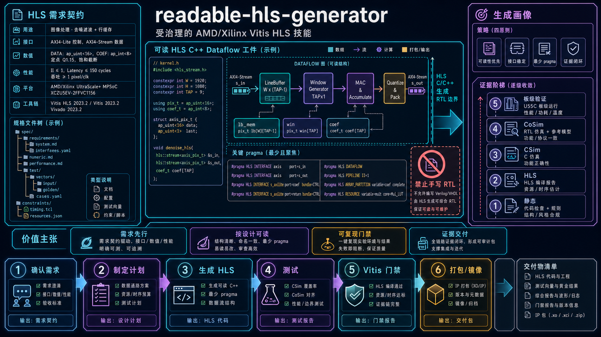
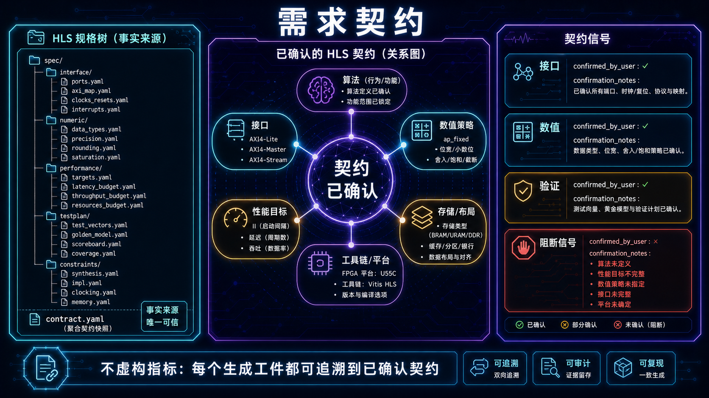
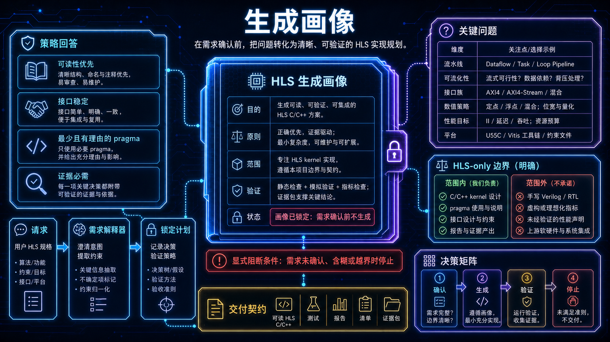
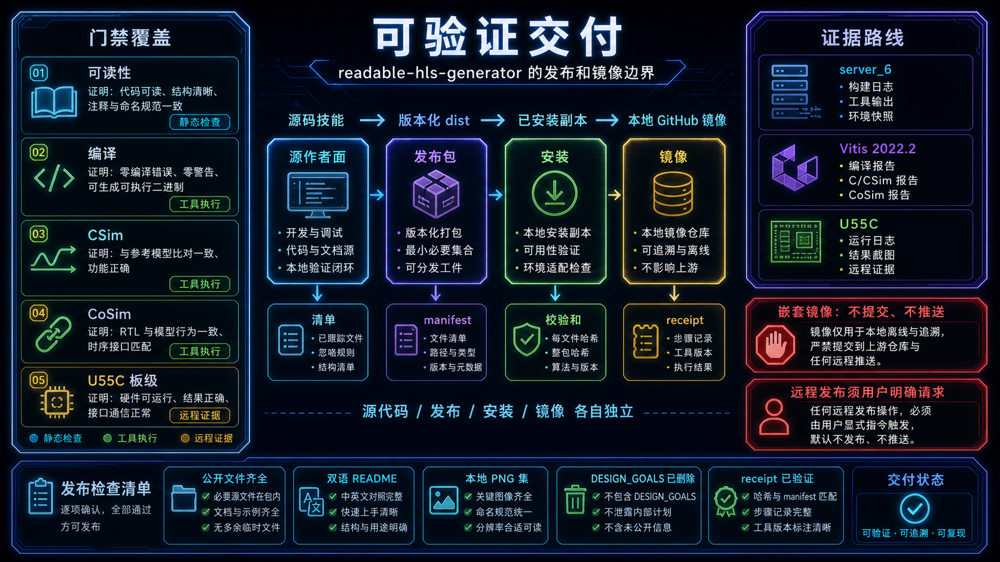

<p align="center">
  <a href="README.md">English</a>
  <span>&nbsp;|&nbsp;</span>
  <a href="README-CN.md"><strong>中文</strong></a>
</p>

<p align="center">
  
</p>

<p align="center">
  <a href="LICENSE"></a>
  
  
  <a href="SKILL.md"></a>
  <a href="references/vitis-hls-2024-2-script-guide.md"></a>
</p>

<h1 align="center">Readable HLS Generator</h1>

<p align="center">
  面向 AMD/Xilinx Vitis HLS 的可读代码生成、复核、验证与可追溯交付 Codex 技能。
</p>

本仓库是一个只面向 HLS 的公开技能包。它把已确认的行为契约转换为可读的 HLS C/C++ kernel、接口感知的 testbench、验证报告和可安装的版本化发布包。当 HLS 生成的 RTL 接口或调试问题能够追溯到 HLS 代码、pragma、配置或报告时，该问题仍属于本技能范围；手写 RTL 不在本技能的生成范围内。

## 为什么维护者会使用它

- **先确认契约。** 生成前必须确认流水需求、可流化性、接口族/接口画像以及确认说明。
- **输出可读。** HLS 源码、testbench 注释、空行边界、pragma 位置和接口意图都属于交付质量要求。
- **验证先于结论。** 静态检查、Vitis 执行、远程验收、发布回执、安装和镜像核验是彼此独立的验证层。
- **保持 HLS-only 边界。** 本技能不生成手写 Verilog/SystemVerilog，也不使用无关硬件工具替代 HLS 验证。

## 01 — 从需求到 HLS 工件

<p align="center">
  
</p>

输入应是用户确认过的 HLS 规格，而不是含糊的自然语言提示。固定阶段为：

```text
已确认需求 → codegen plan → HLS C/C++ 与 testbench → 静态检查 → Vitis 结果
```

契约至少应包含 `pipeline_required`、`streamability`、`interface_family`、`interface_profile`、`confirmed_by_user` 和 `confirmation_notes`。如果涉及吞吐目标、数值策略、任务级并行或器件迁移，应在代码生成前先确认这些约束。

## 02 — 稳定的生成画像

<p align="center">
  
</p>

公开 facade 位于 `scripts/python/integration/hls_adapter.py`，CLI 是稳定的人类入口。它路由 create、write、review、annotate 和 validate，同时保留“已生成”和“已验证”之间的边界。

| 路由 | 覆盖内容 | 典型验证记录 |
| --- | --- | --- |
| Create | 建立已确认的 HLS spec 并生成可读 kernel | spec JSON、codegen plan、源码树 |
| Write | 修改 C/C++、pragma、接口、DATAFLOW 或配置 | diff、契约检查、可读性报告 |
| Review | 检查 HLS 源码、接口、报告和 RTL-facing 事实 | 可追溯的复核发现 |
| Annotate | 在不改变行为的前提下补充中文语义注释 | token/AST 基线门禁 |
| Validate | 运行静态检查，并在需要时执行 Vitis/远程验收 | static-only 或 executed 结果 |

## 03 — 验证与发布边界

<p align="center">
  
</p>

请按验证阶梯使用结果：

1. **静态层** —— 工件契约、HLS 可读性、配置和导入链检查。
2. **工具层** —— 只有真正运行 `vitis-run` 或 `vitis_hls` 才能声明 Vitis 执行。
3. **远程层** —— 本地缺工具时使用配置好的 `erie-remote-ssh` 路由；最终 HLS 验收绑定到选定服务器和工具版本。
4. **发布层** —— 从源目录生成 `dist/readable-hls-generator-vX.Y.Z/`，核验回执和 manifest，再从该发布目录安装，最后把同一发布镜像到本地 `github/` checkout。

旧版本发布目录默认是不可变历史。本次 v0.5.0 只镜像当前版本；镜像工具不会创建 commit、tag、push 或 GitHub Release。

## 从版本化发布目录安装

源目录用于开发，安装必须来自已验证的发布目录：

```powershell
python -B <codex-home>/skills/agents-md-generator/scripts/python/release/install_skill.py `
  .\dist\readable-hls-generator-v0.5.0 `
  --target codex `
  --codex-home <codex-home> `
  --write `
  --replace `
  --install-intent requested
```

安装后重启宿主，使新的技能元数据生效。禁止直接从 `skills/readable-hls-generator/` 安装。

## 快速开始

在 `skills/readable-hls-generator/` 下执行，并为生成结果指定可写目录：

```powershell
python -m scripts.python.cli.readable_hls_generator --version
python -m scripts.python.cli.readable_hls_generator config --path
python -m scripts.python.cli.readable_hls_generator deps check --json
python -m scripts.python.cli.readable_hls_generator scaffold --target hls --name vector_scale --out .\out\hls\spec.json
python -m scripts.python.cli.readable_hls_generator prompt --target hls --spec .\out\hls\spec.json --out .\out\hls\prompt.md --confirm-requirements --confirmation-notes "user-confirmed HLS contract"
python -m scripts.python.cli.readable_hls_generator validate --target hls --spec .\out\hls\spec.json --path .\out\hls\generated --readiness static --no-external
python -m scripts.python.cli.readable_hls_generator readability-gate --target hls --path .\out\hls\generated --profile kernel --style current-project --json
```

仅注释重写时必须保留 baseline，并向校验传入 `--baseline-path`，由 token 和标准化 AST 指纹确认行为未变。

## 仓库地图

| 路径 | 用途 |
| --- | --- |
| `SKILL.md` | 面向 agent 的路由、工作流、约束和参考资料加载规则。 |
| `agents/openai.yaml` | 宿主侧技能元数据。 |
| `assets/examples/` | 最小结构化 HLS spec 与示例。 |
| `assets/templates/` | 可复用 HLS JSON 模板族。 |
| `assets/readme/` | 本 README 对使用的双语本地图示。 |
| `references/` | 按需加载的策略、工作流、优化、配置和远程验收说明。 |
| `scripts/python/cli/` | 公开 CLI 入口。 |
| `scripts/python/config/` | 运行时配置、依赖目录和版本事实。 |
| `scripts/python/generation/` | prompt、scaffold 和工件生成辅助。 |
| `scripts/python/hls_quality_gate/` | HLS 可读性与语义门禁。 |
| `scripts/python/integration/` | 供其他工具调用的稳定 facade。 |
| `scripts/python/release/` | 重建与打包辅助。 |
| `scripts/python/remote/` | 远程 Vitis 与板级验收辅助。 |
| `scripts/python/validation/` | 本地 confidence、工件和 readiness 校验辅助。 |
| `scripts/python/workflow/` | 分阶段 HLS 工作流编排。 |

## 本地镜像流程

父仓库可以在 `github/readable-hls-generator/` 保留一个 remote 为 `https://github.com/Eriemon/hls-generator.git` 的本地 checkout。只有在发布回执、manifest、公开文件和 README 图示都通过后才镜像：

```powershell
python -B <codex-home>/skills/agents-md-generator/scripts/python/release/github_skill_release.py `
  status --project . --skill-dir skills/readable-hls-generator --checkout github/readable-hls-generator
python -B <codex-home>/skills/agents-md-generator/scripts/python/release/github_skill_release.py `
  check --project . --skill-dir skills/readable-hls-generator --release-dir dist/readable-hls-generator-v0.5.0
python -B <codex-home>/skills/agents-md-generator/scripts/python/release/github_skill_release.py `
  mirror --project . --skill-dir skills/readable-hls-generator --release-dir dist/readable-hls-generator-v0.5.0 --checkout github/readable-hls-generator
python -B <codex-home>/skills/agents-md-generator/scripts/python/release/github_skill_release.py `
  verify --project . --skill-dir skills/readable-hls-generator --release-dir dist/readable-hls-generator-v0.5.0 --checkout github/readable-hls-generator
```

本地镜像被父仓库忽略，嵌套仓库保留自己的 Git 历史；本流程不会 commit 或 push。

## 范围与远程验收

如果本地缺少 `vitis-run` 或 `vitis_hls`，应使用工作流生成的 toolchain request，选择配置好的远程服务器，再运行远程验收辅助。不得把真实服务器 ID、主机名、用户名、端口或板卡默认值写入技能包。不能把 static-only 验证说成 Vitis 通过；源代码或发布内容变化后，在当前快照重新上传并运行前，也不能继续声称远程结果代表当前版本。

## 作者与引用

Readable HLS Generator 由 Jiyuan Liu 和 He Li 维护，作者来自东南大学（Southeast University）电子科学与工程学院，并与异构智能与量子计算实验室（HIQC）合作。

科研、教学或软件使用时，请引用 [`CITATION.cff`](CITATION.cff) 中描述的版本：

```bibtex
@software{liu_2026_readable_hls_generator,
  author       = {Jiyuan Liu and He Li},
  title        = {{Readable HLS Generator}: A Codex Skill for Vitis HLS Workflows},
  year         = {2026},
  version      = {0.5.0},
  date         = {2026-08-11},
  url          = {https://github.com/Eriemon/hls-generator},
  license      = {Apache-2.0}
}
```

## 许可证

Apache License 2.0，详见 [LICENSE](LICENSE)。
