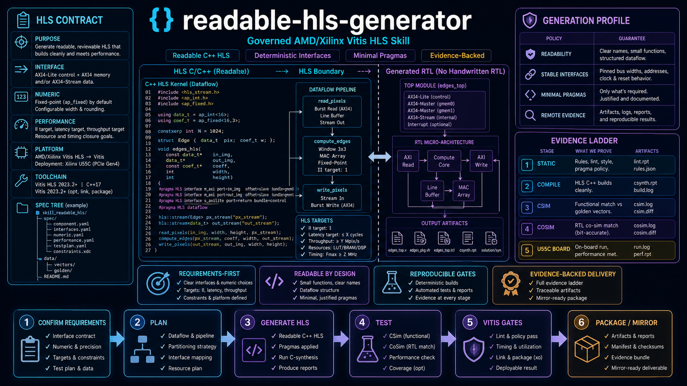
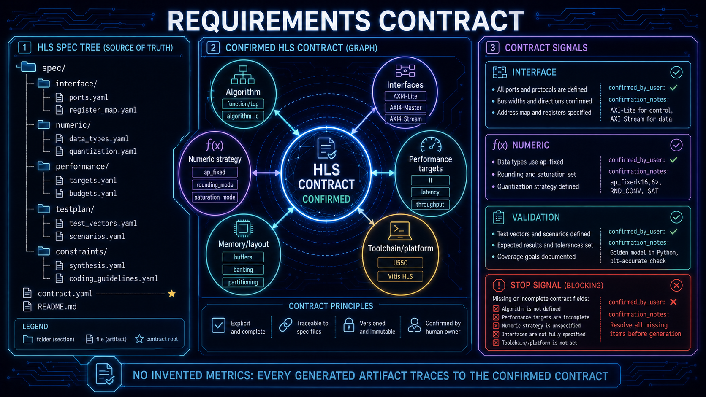
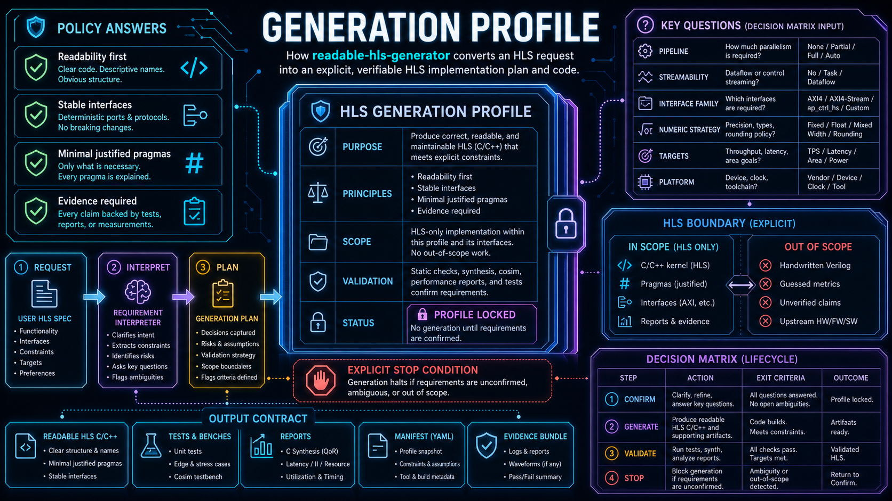
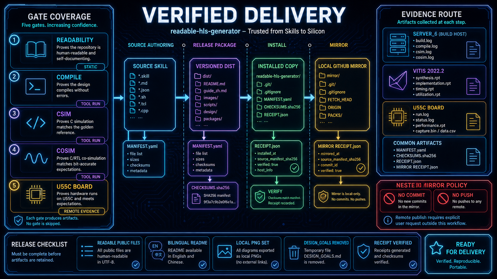

<p align="center">
  <a href="README.md"><strong>English</strong></a>
  <span>&nbsp;|&nbsp;</span>
  <a href="README-CN.md">中文</a>
</p>

<p align="center">
  
</p>

<p align="center">
  <a href="LICENSE"></a>
  
  
  <a href="SKILL.md"></a>
  <a href="references/vitis-hls-2024-2-script-guide.md"></a>
</p>

<h1 align="center">Readable HLS Generator</h1>

<p align="center">
  A governed Codex skill for readable AMD/Xilinx Vitis HLS generation, review, validation, and verification-backed delivery.
</p>

This repository is the public skill package for HLS-only work. It helps an agent turn a confirmed behavior contract into readable HLS C/C++ kernels, interface-aware testbenches, validation reports, and a versioned installable package. HLS-generated RTL interface or debug issues remain in scope only when their cause can be traced to HLS code, pragmas, configuration, or reports.

## Why maintainers use it

- **Contract first.** Generation requires a confirmed HLS requirement contract, including pipeline need, streamability, interface family/profile, and confirmation notes.
- **Readable output.** HLS source and testbench comments, blank-line boundaries, pragma placement, and interface intent are checked as delivery requirements.
- **Verification before claims.** Static checks, Vitis execution, remote acceptance, release receipts, installation, and mirror verification remain separate validation layers.
- **HLS-only boundary.** The skill does not generate handwritten Verilog/SystemVerilog or replace HLS validation with unrelated hardware tools.

## 01 — From requirement to HLS artifact

<p align="center">
  
</p>

The input is a user-confirmed HLS specification rather than an underspecified prompt. The normal staged path is:

```text
confirmed requirements → codegen plan → HLS C/C++ + testbench → static checks → Vitis result
```

The contract should state `pipeline_required`, `streamability`, `interface_family`, `interface_profile`, `confirmed_by_user`, and `confirmation_notes`. When throughput, numeric strategy, task parallelism, or device portability matters, confirm those constraints before code generation.

## 02 — A stable generation profile

<p align="center">
  
</p>

The public facade lives at `scripts/python/integration/hls_adapter.py`; the CLI is the stable human entry point. It routes create, write, review, annotate, and validate requests without hiding the distinction between a generated artifact and a validated artifact.

| Route | What it covers | Typical validation record |
| --- | --- | --- |
| Create | Scaffold a confirmed HLS spec and generate a readable kernel | spec JSON, codegen plan, source tree |
| Write | Modify C/C++, pragmas, interfaces, DATAFLOW, or configuration | diff, contract checks, readability report |
| Review | Inspect HLS source, interfaces, reports, and generated RTL-facing facts | review findings and traceable inputs |
| Annotate | Add Chinese semantic comments without changing behavior | token/AST baseline guard |
| Validate | Run static checks, then Vitis/remote acceptance when requested | static-only or executed result |

## 03 — Verification and release boundaries

<p align="center">
  
</p>

Use the validation ladder deliberately:

1. **Static** — artifact contracts, HLS readability, configuration, and imports.
2. **Tool** — only claim Vitis execution when `vitis-run` or `vitis_hls` actually ran.
3. **Remote** — use the configured `erie-remote-ssh` route when local tools are unavailable; final HLS acceptance is bound to the selected server and tool version.
4. **Release** — package from source into `dist/readable-hls-generator-vX.Y.Z/`, verify the receipt and manifest, install from that release directory, then mirror the same release into the local `github/` checkout.

Older release directories are immutable history. This v0.5.0 update mirrors the current release only; the mirror tool does not create commits, tags, pushes, or GitHub Releases.

## Install a versioned release

The source tree is for development. Install only from a validated release directory:

```powershell
python -B <codex-home>/skills/agents-md-generator/scripts/python/release/install_skill.py `
  .\dist\readable-hls-generator-v0.5.0 `
  --target codex `
  --codex-home <codex-home> `
  --write `
  --replace `
  --install-intent requested
```

After installation, restart the host so the new skill metadata is loaded. Do not install directly from `skills/readable-hls-generator/`.

## Quick start

Run from `skills/readable-hls-generator/` with a writable output directory:

```powershell
python -m scripts.python.cli.readable_hls_generator --version
python -m scripts.python.cli.readable_hls_generator config --path
python -m scripts.python.cli.readable_hls_generator deps check --json
python -m scripts.python.cli.readable_hls_generator scaffold --target hls --name vector_scale --out .\out\hls\spec.json
python -m scripts.python.cli.readable_hls_generator prompt --target hls --spec .\out\hls\spec.json --out .\out\hls\prompt.md --confirm-requirements --confirmation-notes "user-confirmed HLS contract"
python -m scripts.python.cli.readable_hls_generator validate --target hls --spec .\out\hls\spec.json --path .\out\hls\generated --readiness static --no-external
python -m scripts.python.cli.readable_hls_generator readability-gate --target hls --path .\out\hls\generated --profile kernel --style current-project --json
```

For comment-only rewrites, keep a baseline tree and pass `--baseline-path` so non-comment token and normalized AST fingerprints are checked before acceptance.

## Repository map

| Path | Purpose |
| --- | --- |
| `SKILL.md` | Agent-facing routing, workflow, constraints, and reference-loading rules. |
| `agents/openai.yaml` | Host-facing skill metadata. |
| `assets/examples/` | Minimal structured HLS specs and examples. |
| `assets/templates/` | Reusable HLS JSON template families. |
| `assets/readme/` | Local bilingual product illustrations used by this README pair. |
| `references/` | On-demand policy, workflow, optimization, configuration, and remote-validation guidance. |
| `scripts/python/cli/` | Public CLI entry point. |
| `scripts/python/config/` | Runtime configuration, dependency manifests, and version truth. |
| `scripts/python/generation/` | Prompt, scaffold, and artifact generation helpers. |
| `scripts/python/hls_quality_gate/` | HLS readability and semantic gate logic. |
| `scripts/python/integration/` | Stable local facade for other tools and scripts. |
| `scripts/python/release/` | Rebuild and packaging helpers. |
| `scripts/python/remote/` | Remote Vitis and board-acceptance helpers. |
| `scripts/python/validation/` | Local confidence, artifact, and readiness validation helpers. |
| `scripts/python/workflow/` | Staged HLS workflow orchestration. |

## Local mirror workflow

The parent repository may keep a local checkout at `github/readable-hls-generator/` whose remote is `https://github.com/Eriemon/hls-generator.git`. Mirror only a validated release and verify the receipt, manifest, public files, and README assets:

```powershell
python -B <codex-home>/skills/agents-md-generator/scripts/python/release/github_skill_release.py `
  status --project . --skill-dir skills/readable-hls-generator --checkout github/readable-hls-generator
python -B <codex-home>/skills/agents-md-generator/scripts/python/release/github_skill_release.py `
  check --project . --skill-dir skills/readable-hls-generator --release-dir dist/readable-hls-generator-v0.5.0
python -B <codex-home>/skills/agents-md-generator/scripts/python/release/github_skill_release.py `
  mirror --project . --skill-dir skills/readable-hls-generator --release-dir dist/readable-hls-generator-v0.5.0 --checkout github/readable-hls-generator
python -B <codex-home>/skills/agents-md-generator/scripts/python/release/github_skill_release.py `
  verify --project . --skill-dir skills/readable-hls-generator --release-dir dist/readable-hls-generator-v0.5.0 --checkout github/readable-hls-generator
```

The local mirror is intentionally ignored by the parent repository. The nested repository keeps its own Git history; this workflow performs no commit or push.

## Scope and remote acceptance

When local `vitis-run` or `vitis_hls` is unavailable, create the toolchain request produced by the workflow, choose a configured remote server, and use the remote acceptance helpers. Never encode real server IDs, hostnames, usernames, ports, or board-specific defaults in this package. Do not call static-only validation a Vitis pass, and do not call a remote result current after changing source or release content until the current snapshot has been uploaded and rerun.

## Authors and citation

Readable HLS Generator is maintained by Jiyuan Liu and He Li, School of Electronic Science and Engineering, Southeast University（东南大学）, with the Heterogeneous Intelligence and Quantum Computing Laboratory (HIQC).

For software, research, or teaching use, cite the release described in [`CITATION.cff`](CITATION.cff):

```bibtex
@software{liu_2026_readable_hls_generator,
  author       = {Jiyuan Liu and He Li},
  title        = {{Readable HLS Generator}: A Codex Skill for Vitis HLS Workflows},
  year         = {2026},
  version      = {0.5.0},
  date         = {2026-08-11},
  url          = {https://github.com/Eriemon/hls-generator},
  license      = {Apache-2.0}
}
```

## License

Apache License 2.0. See [LICENSE](LICENSE).
